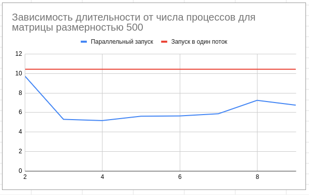
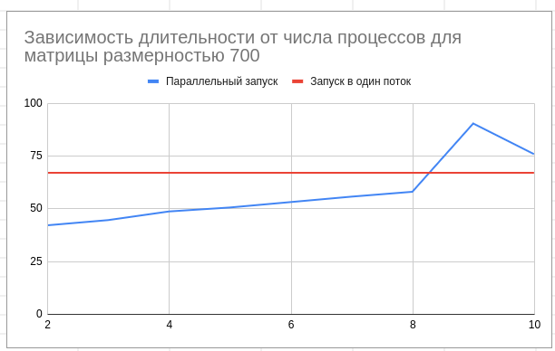

**Простые операции с разреженными матрицами MPI**

Реализована операция сложения и умножения двух разреженных матриц с использованием MPI.
Из-за частых отправлений данных от главного потока остальным, распараллеливание получилось неэффективным, что можно увидеть по пайплайну :(
Также реализован скрипт для генерации разреженной матрицы.

**Что можно еще потестить (для себя):**

[ ] Попробовать отдавать потокам готовые данные за один проход, после чего просто собрать данные обратно

[ ] Сделать блочное умножение...

**Графики**

**Выводы**

1. Пайплайн показывает жуткую заторможенность.
2. По графикам виден прирост, однако он минимален, и легко теряется, если переборщить с числом процессов из-за слишком неэффективной траты времени при отправке данных
